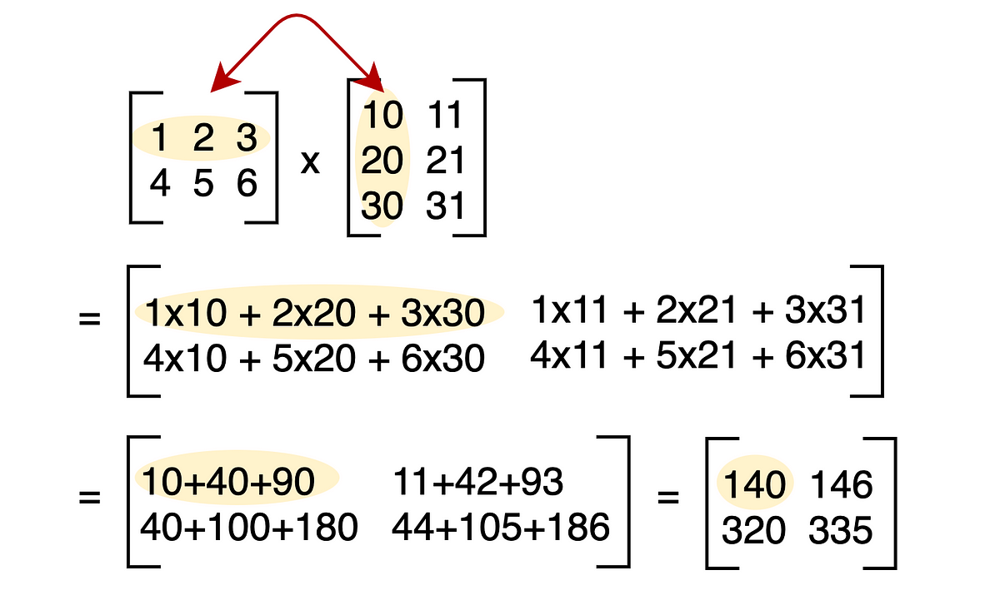

# Matrix Multiplication Project

## Table of Contents

- [Project Objectives](#project-objectives)
- [Description](#description)
- [Features](#features)
- [Technologies Used](#technologies-used)
- [Setup and Execution](#setup-and-execution)
- [Usage](#usage)
- [Sample Input and Output](#sample-input-and-output)
- [Grading Criteria](#grading-criteria)
- [Note](#note) 
- [Conclusion](#conclusion)

## Project Objectives:

- Understanding of programming concepts such as variables, loops, and conditional statements.
- Proficiency in creating and manipulating 2-dimensional arrays.
- Ability to control user input and casting of data from one type to another.
- Understanding of string formatting techniques to display results in a readable and organized format.
- Ability to analyze problem requirements and develop algorithms to solve mathematical problems.

## Description:

This project requires the development of a program that performs matrix multiplication. The program will take two matrices as input from the user and compute their product. The product will be stored in a third matrix, which will then be displayed.

Matrix multiplication is performed when multiplying a matrix **A** of dimensions (n, m) with matrix **B** of dimensions (m, p). The result is a matrix **C** of dimensions (n, p). The multiplication is performed by multiplying the components of the two matrices row by column.
### Example:




Write a program that performs the multiplication of two matrices A and B taken from the user. The result of the multiplication will be stored in a third matrix C, which will then be displayed.


## Features:

- **Matrix Multiplication**: The program will take two matrices as input from the user and compute their product.
- **Arbitrary Matrix Size**: The program will handle matrices of varying dimensions, provided they meet input criteria.
- **Error Handling**: The program will ensure graceful handling of invalid input (e.g., non-numeric data, mismatched dimensions).
- **Formatted Output**: The program will display the result of the multiplication in a structured format.

## Technologies Used:

- **Java 21 (LTS)**: Required for compatibility with the latest Java features.
- **JDK 21**: Recommended for compiling and running the project.

## Setup and Execution:

### Prerequisites:

- **Java Development Kit (JDK) 21**: Ensure JDK 21 is installed and configured on your system.

### Running the Program:

1. **Clone or Download the Repository**:

   ```bash
   git clone https://github.com/AbuduSamadu/DSA/tree/main/Lab/matrixMultiplication

   
   cd DSA/Lab/matrixMultiplication

2. **Compile the Java Program**:

```bash
javac MatrixMultiplication.java
```

3. **Run the Java Program**:

```bash
java MatrixMultiplication
```

## Usage:

- **Enter Matrix Dimensions**: On running the program, you will be prompted to enter the dimensions of the matrices.
- **Enter Matrix Elements**: After entering the dimensions, you will be prompted to enter the elements of the matrices.
- **View Results**: The program will display the result of the multiplication in a structured format.

## Sample Input and Output:

### Sample Input:

```plaintext
Enter the number of rows for the first matrix: 2
Enter the number of columns for the first matrix: 3
Enter the elements of the first matrix:
12 2 4
10 1 1

Enter the number of rows for the second matrix: 3
Enter the number of columns for the second matrix: 2
Enter the elements of the second matrix:
2 2
1 2
1 1

``` 

### Sample Output:

```plaintext
Matrix C:

30 32
22 23
```

.png)

## Grading Criteria:

| Criteria           | Points | Description                                                                 |
|--------------------|--------|-----------------------------------------------------------------------------|
| Correctness        | 40     | The program should produce the correct results for the given input.
| Input Validation   | 10     | The program should validate the input to ensure it meets the specified criteria.
| Code Quality       | 20     | The code should be well-structured, readable, and follow best practices.
| Output Format      | 10     | The output should be formatted correctly and clearly present the results.
| Efficiency         | 10     | The program should be optimized for performance and resource usage.


## Note:

- Input Validation: The program will terminate if the dimensions of the matrices do not match the input criteria or if the input elements are not integers. This  will ensure that the program does not attempt to perform multiplication on matrices of different sizes or with non-numeric data.

## Conclusion:

This project provides a hands-on example of working with arrays, conditional logic, and basic mathematical operations in Java, while also demonstrating string formatting techniques for structured console output. 